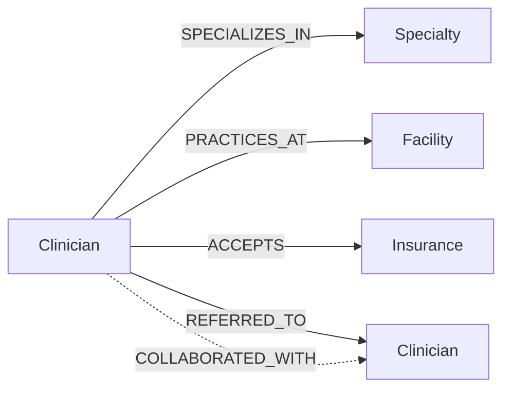

# CarePath

**Explainable specialist referrals powered by CognoDB.**

CarePath helps a care coordinator find the right specialist through the professional relationships they already trust. Instead of returning a flat directory, it reveals the referral path, clinical fit, insurance coverage, facility, and availability behind every recommendation.

## Product walkthrough

1. Pick the clinician who is making the referral.
2. Choose the specialty and, optionally, the patient's insurance.
3. CarePath traverses up to three professional relationships and ranks matching specialists.
4. Open a recommendation to see the exact trust path and why the match ranked highly.

The UI includes purposeful loading, no-results, configuration, and database-unreachable states.

## Why a graph database?

The useful question is not simply “which cardiologists accept this insurance?” It is “which suitable cardiologists can this clinician reach through one or more trusted professional relationships, and what is the path?”

In a relational model, variable-depth traversal requires recursive CTEs or repeated self-joins, and returning the path itself adds more complexity. In CognoDB, clinicians and care entities are first-class nodes; professional trust is a relationship. A variable-length pattern such as `[:COLLABORATED_WITH|REFERRED_TO*1..3]` expresses the core recommendation in the same shape as the domain.

The graph also leaves useful extensions open: referral loops, emerging clinical communities, overloaded referral hubs, and shortest trusted paths between facilities can be added without redesigning a join-heavy schema.

## Graph model



### Node properties

| Label | Key properties |
| --- | --- |
| `Clinician` | `id`, `name`, `title`, `avatar`, `experience`, `nextAvailable`, `rating` |
| `Specialty` | `slug`, `name` |
| `Facility` | `id`, `name`, `city` |
| `Insurance` | `slug`, `name` |

Professional relationships also store `cases`, a realistic signal that can later contribute to ranking.

## Main graph queries

- **Explainable specialist recommendations:** matches clinical and insurance constraints, traverses one to three `COLLABORATED_WITH` or `REFERRED_TO` relationships, returns both relationship types and all clinician names in the path, then scores availability, rating, and path distance.
- **Clinician network:** expands a selected clinician's immediate collaboration and referral neighborhood.
- **Catalog queries:** list clinicians and specialties for human-friendly UI filters.

Every value supplied by a user is passed through the Neo4j driver's parameter object. Cypher is never assembled with string concatenation. See [`src/graph/queries.js`](src/graph/queries.js).

## Architecture

```text
Browser UI  →  Express API  →  Repository layer  →  Neo4j driver  →  CognoDB
```

- `public/` contains a responsive, dependency-free interface.
- `src/server.js` owns HTTP concerns, validation, and graceful 503 responses.
- `src/graph/repository.js` owns sessions, transaction scope, and Neo4j value conversion.
- `src/graph/queries.js` keeps parameterized Cypher visible and reviewable.
- `scripts/seed.js` creates realistic demo data in one write transaction.

## Run locally

Prerequisites: Node.js 20+ and a free CognoDB instance.

1. Sign up at [CognoDB Cloud](https://console.cognodb.com/signup), create a free `c0` instance, and copy the generated password when it is shown.
2. Install dependencies:

   ```bash
   npm install
   ```

3. Copy `.env.example` to `.env` and fill in the URI and password:

   ```env
   COGNODB_URI=bolt+s://<instance-id>.databases.cognodb.cloud
   COGNODB_USERNAME=cognodb
   COGNODB_PASSWORD=<password>
   ```

4. Load the sample graph (this clears the target database first):

   ```bash
   npm run seed
   ```

5. Start the application and open `http://localhost:3000`:

   ```bash
   npm run dev
   ```

## Tests and checks

```bash
npm test
npm run check
```

The included tests cover configuration defaults and secret validation. For a production codebase, the next layer would use an ephemeral graph instance to verify traversal results and transaction behavior end-to-end.

## Deploy

The included `render.yaml` makes the app deployable as a Render web service:

1. Push this repository to GitHub.
2. Create a Render Blueprint from the repository.
3. Add `COGNODB_URI` and `COGNODB_PASSWORD` in the service environment.
4. Run `npm run seed` once against the same instance.
5. Verify `/api/health`, then open the service URL.

Any Node.js host with outbound Bolt/TLS support will work. Keep the CognoDB credentials in the host's encrypted environment settings—never in the repository.

## Failure behavior

Missing configuration and driver/query failures return a stable `503` response without exposing credentials or database internals. The browser translates that response into an actionable offline state. Sessions are closed in `finally` blocks, and the driver closes on process shutdown.

## Design decisions and trade-offs

- Ranking is intentionally legible rather than “AI powered”: rating, path length, and availability produce an explainable score.
- The demo uses a small dataset appropriate for the CognoDB free tier. The query limits paths to three hops and results to 12 to prevent accidental graph explosion.
- Availability is seeded as display text to keep the assignment focused. A production version would model time slots as dated nodes or normalized timestamp properties.
- Insurance is an exact filter. Real payer networks would also model plan, geography, effective dates, and facility-level contracts.

## Repository checklist

- [x] Thoughtful labeled graph model and diagram
- [x] Realistic, repeatable seed script
- [x] Parameterized openCypher queries
- [x] Multi-hop and variable-length traversal
- [x] Functional responsive web application
- [x] Loading, empty, and error states
- [x] Environment-only credentials
- [x] Graceful database failure handling
- [x] Free-tier deployment definition
- [ ] Add live demo URL after deployment
- [ ] Add 60–90 second screen recording link

## Suggested demo script

Start from Dr. Ananya Rao, select Cardiology, and search. Open the top result to explain the trust path and ranking. Repeat with an insurance filter, then briefly show the offline state by stopping the database or using an invalid local URI. Close on the graph model and the parameterized multi-hop query in the repository.

---

Built for the Wexa AI CognoDB take-home assignment.
